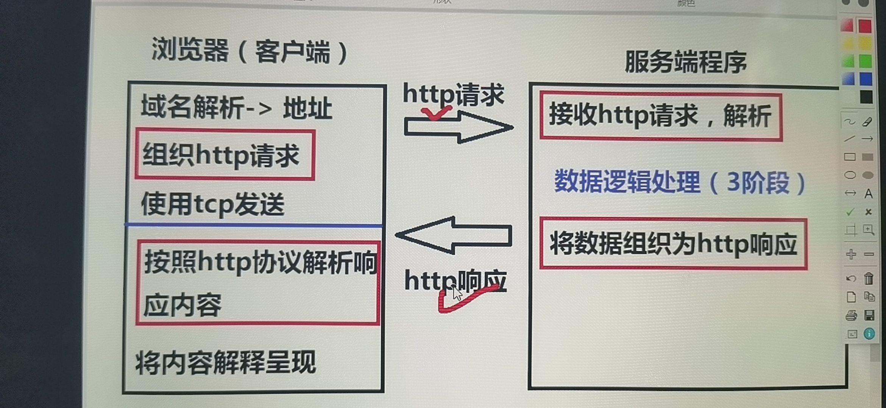

# 网络基础概念

##### IP地址
> 功能：确定一台主机的网络路由位置
> 查看本机网络地址命令：ifconfig(linux)、ipconfig(Windows)

> 结构：
> ipv4 点分十进制表示  172.40.91.185 每一个部分取值范围0~255
> ipv6 128位 扩大了地址范围

注意：
> 在同一局域网内的ip都各不相同

##### 域名
> 定义：给网络服务器地址起的名字
> 作用：方便记忆，表达一定的含义
> ping [ip]：测试和某个主机是否联通

##### 端口号
> 作用：端口号是网络地址的一部分，用于区分主机上不同的网络应用程序
> 特点：一个系统中的应用监听的端口号不能重复
> 取值范围：1~65535
>> 1~1023 系统应用或者大众程序监听端口
>> 1024~65535 自用端口，推荐使用10000以上的

# 传输层服务

## 面向连接的传输服务(基于TCP协议的数据传输)
1、传输特征：提供了可靠的数据传输
2、实现手段：在通信前建立数据连接，通信结束要断开
> 三次握手
> > 客户端向服务器发送消息报文请求连接
> > 服务器收到请求后，回复报文确定可以连接
> > 客户端收到回复，发送报文建立连接

## 面向无连接的传输服务(基于UDP协议的数据传输)
1、传输特点：不保证传输的可靠性
2、适用情况：网络较差，对传输可靠性要求不高

# socket套接字编程

## 套接字介绍

1、套接字：实现网络编程进行数据传输的一种技术手段
2、Python实现套接字编程：import socket
3、套接字分类:
> 流式套接字(SOCK——STREAM)：以字节流传输数据，实现tcp网络传输

> 数据报套接字(SOCK_DGRAM)：以数据报形式传输数据，实现udp网络传输

# tcp套接字编程

## 服务端流程

> 1、socket -- 创建套接字
> 2、bind -- 绑定地址
> 3、listen -- 监听
> 4、accept -- 等待客户端连接
> 5、send/recv -- 沟通
> 6、close -- 结束

***1、创建套接字***

```
sockfd=socket.socket(socket_family=AF_INET,socket_type=SOCK_STREAM,proto=0)
功能：创建套接字
参数：
    socket_family：   网络地址类型 AF_INET表示ipv4
    socket_type： SOCK_STREAM(流式)、SOCK_DGRAM（数据包）
    proto：   通常为0   选择子协议
返回值：套接字对象
```

***2、绑定地址***
> 本地地址：'localhost','127.0.0.1' -- 别人计算机的客户端访问不来了，只有本机的客户端是可以
> 网络地址：'192.168.79.140' -- 别人和自己都必须通过192.168.79.140这个地址来访问
> 自动获取地址：'0.0.0.0' -- 别人通过192.168.79.140访问
```
sockfd.bind(addr)
功能：绑定本机网络地址
参数：二元元组（ip,port）('0.0.0.0',8888)
```

***3、设置监听***
```
sockfd.listen(n)
功能：将套接字设置为监听套接字，n是确定监听队列的大小
参数：监听队列的大小
```

***4、等待处理客户端连接请求***
```
connfd,addr = sockfd.accept()
功能：阻塞等待处理客户端请求
返回值：connfd：客户端连接套接字
       addr：链接的客户端地址
```

***5、消息收发***
```
data = connfd.recv(buffersize)
功能：接受客户端消息
参数：每次接受消息的大小
返回值：接受到的内容

n = connfd.send(data) 
功能：发送消息
参数：要求发送的内容 bytes格式
返回值：发送的字节shu
```
> encode() 将字符串转化为字节穿
> decode() 将字节串转化为字符串

***6、关闭套接字***
```
sockfd.close()
功能：关闭套接字
```

##### 代码
```
import socket

# 创建tcp套接字
sockfd = socket.socket(socket.AF_INET,socket.SOCK_STREAM)

# 绑定地址
sockfd.bind(('0.0.0.0',8888))

# 设置监听
sockfd.listen(5)

# 阻塞等待链接
print("Wait for connect...")
connfd,addr = sockfd.accept()
print(f"Connect form {addr} ...")

# 收发消息
data = connfd.recv(1024)
print(f"收到：{data}")
connfd.send(b'Thanks')

# 关闭套接字
connfd.close()
sockfd.close()
```
注意：
> 服务端绑定地址也要正确

##　客户端流程

> 1、socket -- 创建套接字
> 2、bind -- 绑定地址(可选)
> 3、connect -- 连接
> 5、send/recv -- 沟通
> 6、close -- 结束

***1、创建套接字***
> 注意：只有相同的套接字才能进行通信

***2、请求连接***
```
sockfd.connect(server_addr)
功能：连接服务器
参数：元组  服务器地址
```

***3、收发消息***
> 注意：防止两段都阻塞，recv，send要配合

***4、关闭套接字***
> sockfd.close()

代码：
```
from socket import *

# 创建tcp套接字
sockfd = socket() # 使用默认参数 -> tcp套接字

# 连接
sockfd.connect(('127.0.0.1',8888))

# 收发消息
data = input("Msg>>")
sockfd.send(data.encode())
data = sockfd.recv(1024)
print("Server:",data.decode())

# 关闭
sockfd.close()
```

注意：
> 客户端连接服务端的时候一定要确保连接地址正确


##### 注意
> 客户端断开连接时，会给服务器端发送一个null

#### 客户端循环发送消息
```
# 收发消息
while True:
    data = input("Msg>>")
    if not data:
        break
    sockfd.send(data.encode())
    data = sockfd.recv(1024)
    print("Server:",data.decode())
```
#### 服务端循环接受消息
```
# 收发消息
while True:
    # 阻塞等待链接
    print("Wait for connect...")
    connfd,addr = sockfd.accept()
    print(f"Connect form {addr} ...")

    while True:
        data = connfd.recv(1024)
        if not data:
           break
        print(f"收到：{data.decode()}")
        connfd.send(b'Thanks')
    connfd.close()
```

#### 网络收发缓冲区
当网络缓冲区里面没内容的时候recv才会阻塞
> 1、网络缓冲区有效的协调了消息的收发速度
> 2、send和recv实际是向缓冲区发送接受消息，当缓冲区不为空recv就不会阻塞

#### tcp粘包
> 原因：tcp以字节流的方式传输，没有消息边界。多次发送的消息被一次接受，此时就会形成粘包。

> 影响：如果每次发送内容都是一个独立的含义，需要接受端独立解析此时粘包会有影响

> 处理方法:
> > 1、人为的添加消息边界
> > 2、控制发送速度

# UDP套接字编程

## 服务端流程
> 1、socket -- 创建套接字
> 2、bind -- 绑定地址
> 3、recvfrom -- 接受  
> 4、sendto -- 发送
> 5、close -- 关闭套接字

***1、创建数据报套接字***
```
sockfd = socket(AF_INET,SOCK_DGRAM)
```

***2、绑定地址***
```
sockfd.bind(addr)
```

***3、消息收发***
```
data,addr = sockfd.recvfrom(buffersize)
功能：接受udp消息
参数：每次接受多少字节
返回值：data    接受到的内容
       addr    目标地址

n = sockfd.sento(data,addr)
功能：发送udp消息
参数：data 发送的内容
    addr 目标地址
返回值：发送的字节数
```

***4、关闭套接字***
```
sockfd.close()
```

代码：
```
from socket import *

# 创建套接字
sockfd = socket(AF_INET,SOCK_DGRAM)

# 绑定地址
sockfd.bind(('0.0.0.0',8888))

# 收发消息
while True:
    data,addr = sockfd.recvfrom(1024)
    print(data.decode())
    sockfd.sendto(b"Thanks",addr)
    
# 关闭套接字
sockfd.close()
```

## 服务端流程
> 1、socket -- 创建套接字
> 3、sendto -- 发送
> 4、recvfrom -- 接受  
> 5、close -- 关闭套接字

注：数据报消息传输有消息边界，不会产生粘包问题

# socket套接字属性
> sockfd.type -- 套接字类型(流式、数据报)
> sockfd.family -- 套接字的地址类型(ipv4、ipv6)
> sockfd.getsockname() -- 获取绑定地址
> sockfd.fileno() -- 文件描述符
> sockfd.getpeername() -- 连接端地址(连接套接字可以使用)

> sockfd.setsockopt(level,option,value)
```
功能：设置套接字选项 SOL_SOCKET
参数：level 选择类别
    option 具体选项内容
    value 选项值
sockfd.setsockopt(SOL_SOCKET,SO_REUSEADDR,1) # 当意外断开，绑定的端口会被立刻回收
```

# UDP套接字广播
brodcast: 广播地址

> ·广播定义：一端发送多点接受
> ·广播地址：每个网络的最大地址为发送广播的地址，向该地址发送，则网段所有主机都能接收

# TCP套接字之HTTP传输

## HTTP协议（超文本传输协议）
1、用途：网页获取，数据传输
2、特点
3、网页请求过程
> 1、客户端(浏览器)通过tcp传输，发送http请求给服务端
> 2、服务端接受到http请求后进行解析
> 3、服务端处理请求内容，组织响应内容
> 4、服务器将响应内容以http响应格式发送给浏览器
> 5、浏览器接受到响应内容，解析展示



### HTTP请求(request)

***1、请求行***
具体的请求类别和请求内容
```
GET         /       HTTP/1.1
请求类别    请求内容   协议版本
```
请求类别：每个请求类别表示要做不同的事情
> get: 获取网络资源
> post: 提交一定的信息，得到反馈
> head: 只获取网络资源的响应头
> put: 更新服务器资源
> delete: 删除服务器资源

***2、请求头***
对请求的进一步解释和描述
***3、空行***
***4、请求体***
请求参数或者提交内容

注：请求行和空行一定要有，另外两个可以没有

### http响应(response)
响应格式：响应行，响应头，空行，响应体

***1、响应行***
返回基本的响应情况
```
HTTP/1.1    200     OK
版本信息    响应码  附加信息
```
响应码：
> 1xx: 提示信息，表示请求被接受
> 2xx: 响应成功
> 3xx: 响应需要进一步操作，重定向
> 4xx: 客户端错误
> 5xx: 服务器错误

<a herf='http://www.javashuo.com/article/p-vtkttzmg-cp.html'>响应码介绍</a>

***2、响应头***
对响应内容的描述
***3、响应体***
响应的主体内容


##### 代码：
```
响应行：response = "HTTP/1.1 200 OK\r\n"    
响应头：response+="Content-Type:text/html\r\n"
空行：response+="\r\n"
响应体：response+=f.read()
```


