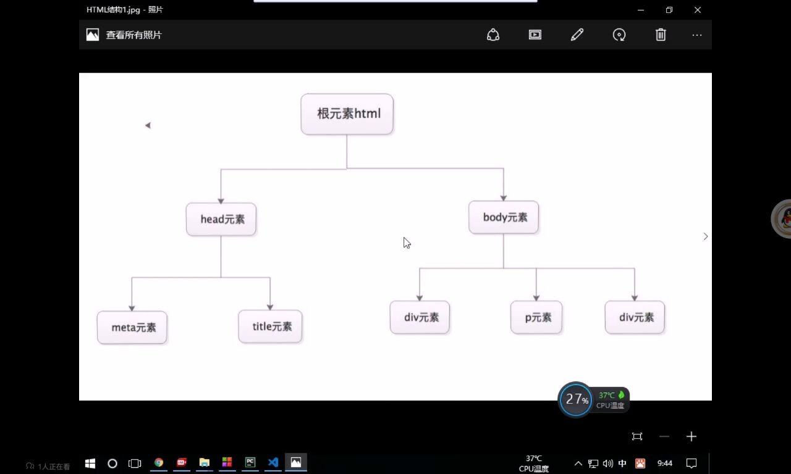
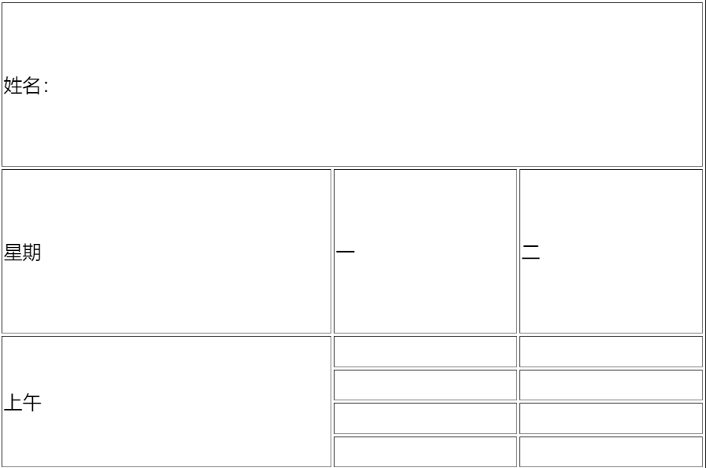
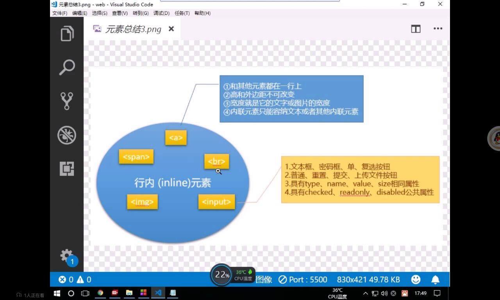
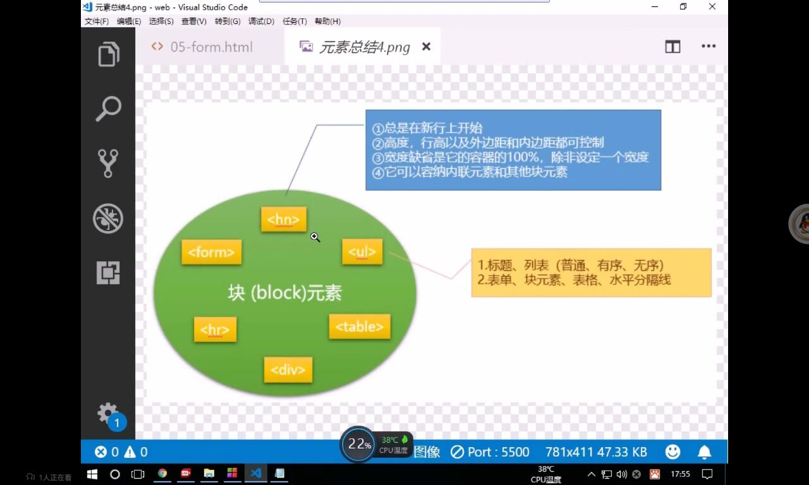
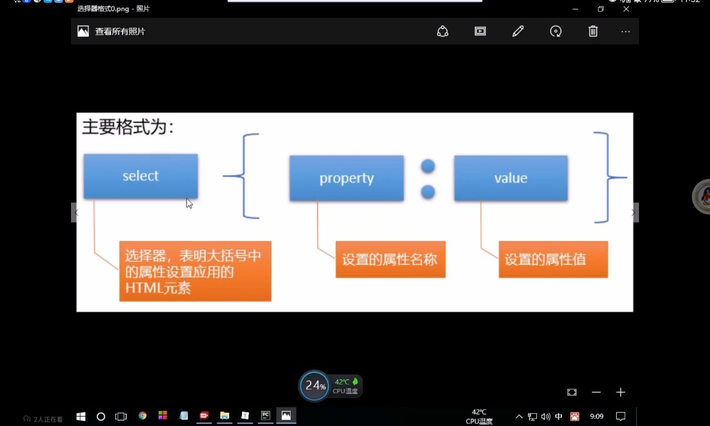

# Web开发介绍
介绍HTML、CSS、JavaScrpt最基础的最实用的语法功能

# 一、web前段介绍

<a href="https://www.w3school.com.cn/h.asp">参考手册</a>

## 1. 什么是页面
网页基于浏览器的应用程序，是数据展示的载体
## 2. 网页的组成
***浏览器***
> ·向服务器发送用户请求指令
> ·接收并解析数据展示给用户

***服务器***
> ·储存数据
> ·处理并响应请求

***协议***
> ·规范数据在传输过程中的打包方式

## 3. 网页的优势

***及时响应***
> ·更新服务端页面即可完成更新
> ·客户端重新加载即兑现内容

***无需安装和更新***
> ·无需安装任何软件
> ·只需要有浏览器即可执行程序

# 二、HTML语法介绍


## HTML介绍
超文本标记语言浏览器能够识别和解析的语言，通过标签的形式构建页面的结构和填充内容

## 标签
标签也称为标记或元素，用于在网页中标记内容



***语法***
> 标签使用< >未标记，标签名不区分大小写，推荐写小写


***分类***
> ·双标签：成对出现，包含开始标签和结束标签
> ·单标签：只有开始标签

***标签属性***
> 标签属性写在开始标记中，使用空格与标签名隔开，用于设置当前标签的显示内容或者修饰效果，由属性名和属性值组成
> 同一个标签可以添加若干组标签属性，中间用空格隔开

***标签嵌套***
在双标签中书写其他标签，就称为标签嵌套
> ·嵌套外层为父元素，里层为子元素
> 多层嵌套结构中，所有外层元素统称为祖先元素，内层元素统称为后代元素
> ·平级结构互为兄弟元素

***HTML语法规范***
> ·标签名不区分大小写，建议使用小写
> ·关键代码要有注释，上面注释针对的是下面的内容，快捷键：ctrl+/


# 三、常用的标签介绍


## body中常用的标签

##### 文本标签
***1.标题标签***
> 自带加粗效果，从h1到h6字体大小逐渐递减
```html
    <h1>一级标题</h1>
    <h2>二级标题</h2>
    <h3>三级标题</h3>
    <h4>四级标题</h4>
    <h5>五级标题</h5>
    <h6>六级标题</h6>
```

***2.段落标签***
```html
    <p>段落文本</p>
```

***3.普通文本标签***
```html
    <b>加粗标签</b>
    <strong>强调标签，效果和b标签相同</strong>
    <i>斜体标签</i>
    <u>删除线标签</u>
    <span>行分区标签,用于对特殊文本特殊处理</span>
    <label>普通文本标签，常与表单控件结合实现文本与控件的绑定</label>
```

***4.换行标签***
> 浏览器会忽略代码中的换行和空格，只显示为一个空格。想要实现页面中的换行，需要借助于换行标签
```html
    <br>    单标签
```

***5.水平线标签***
> 在页面中插入一条水平分割线
```html
    <hr>    单标签
```

***6.字符实体***
> 某些情况下浏览器会将一些特殊字符按照HTML的方式解析影响显示效果。此时需要将这类字符转换为其他的形式书写。例：
```
·使用&lt;在页面中呈现"<"
·使用&gt;在页面中呈现">"
·使用&nbsp;在页面中呈现" "
·使用&copy;在页面中呈现"©"
·使用&yen;在页面中呈现"￥"
```

##### 容器标签
> 常用于页面结构划分,结合CSS实现网页布局
```html
    div#top -- 快速生成id=top的div
    <div id="top">页面顶部区域</div>
    <div id="main">页面主题区域</div>
    <div id="bottom">页面底部区域</div>
```
##### 图片和超链接标签(内联/ 块 元素)
> 图片标签：用于在网页中插入一张图片
```html
     
    属性：
        width/height -- 用于设置图片的尺寸
        src -- 图片存放路径
        alt -- 图片找不到显示的内容
        title -- 鼠标放在上面显示的内容

```
> 超链接标签：用户可以点击超链接实现跳转至其他页面

```html
    <a href="" target="">页面显示内容(文字、图片)</a>
    属性：
        href -- 超链接 点击跳转到链接页面
        target -- 默认 在当前窗口打开，_blank 在其他页面打开
        href -- #top 可以直接跳转到id=top位置的地方
```

##### 常用结构标签

***无序列表***
> 默认用实心圆点表示列表
```html
    ul>li*5 -- 快速生成有五个表项的无序列表
    <ul>
        <li>文字</li>
        <li>超级链接</li>
        <li>图片</li>
        <li></li>
        <li></li>
    </ul>
```
***有序列表***
> 默认使用阿拉伯数字标识每一条数据，可以用start属性设置起始位置，默认为1
```html
    ol>li*5 -- 快速生成有五个表项的有序列表
    <ol>
        <li></li>
        <li></li>
        <li></li>
        <li></li>
        <li></li>
    </ol>
    属性：
        start -- 设置标号的起始位置
        type -- 设置标号的种类
        reversed -- 该属性没值
```

***列表嵌套***
> 在已有列表中嵌套添加另一个列表，常见于下拉菜单

```html
    <ul>
        <li>第一章
            <ul>
                <li>第一节</li>
                <li>第二节</li>
            </ul>
        </li>
        <li>第二章
            <ul>
                <li>第一节</li>
                <li>第二节</li>
            </ul>
        </li>
    </ul>
```

##### 表格标签
> 表格由行和单元格组成，常用于直接的数据展示或者辅助排版

```html
    table>tr*2>td*3     -- 生成两行三列的表
    <table border="">
        <caption>学生信息</caption> -- 主题
        <tr> 
            <td></td>
            <td></td>
            <td></td>
        </tr>
        <tr>
            <td></td>
            <td></td>
            <td></td>
        </tr>
    </table>
    列可以用th -- 专门用来表示标题的
    属性：
        border -- 边框的像素宽度
```
注意：少用table,尽量多使用div

***单元格合并***
> 用于调整表格结构，分为跨行合并和跨列合并，合并之后需要删除别合并的单元格，保证报个的结构完整

```html
    <table border="1" width="600" height="400">
        <tr>
            <td colspan="3">姓名：</td>
        </tr>
        <tr>
            <td>星期</td>
            <td>一</td>
            <td>二</td>
        </tr>
        <tr>
            <td rowspan="4">上午</td>
            <td></td>
            <td></td>
        </tr>
        <tr>
            <td></td>
            <td></td>
        </tr>
        <tr>
            <td></td>
            <td></td>
        </tr>
        <tr>
            <td></td>
            <td></td>
        </tr>
    </table>
```

实现效果:


#### 表单标签

> 表单用于采集用户的信息并提交给服务器，由表单元素和表单控件组成。表单元素form负责提交数据给服务器，表单控件负责收集数据
***表单使用***
```html
    <form action="#">
        <div>
            <label for="name">用户名</label> -- for -- 输入文本框的id，将label和input关联起来
            <input type="text" id="name">
        </div>
        <div>
            <label for="password">密&nbsp;&nbsp;&nbsp;码:</label>
            <input type="password" id="password">
        </div>
    </form>
    input 属性：
        type -- 表示输入
    属性：
        action -- 提交的地址，# 表示提交到当前页面
```
> lable标签
```html
    <label for="name">用户名</label> -- for -- 输入文本框的id，将label和input关联起来
    <input type="text" id="name">
```
> input标签
```html
    <input type="text" id="name">
    属性：
        type -- text，password...
```
***单项选择标签***
> option下拉框：
```html
    <select name="xl" id="xl">
        <option value="1">小学</option>
        <option value="2">中学</option>
        <option value="3">大学</option>
    </select>
    属性：
        value -- 是选项提供的值

```
> radio：
```html
    <div>
        <label for="sex">性别</label>
        <input type="radio" value="1" name="sex">男
        <input type="radio" value="2" name="sex">女
    </div>
    当radio的name属性值相同时，则会互斥，就是两个或者三个中只能选中一个。
```

***多项选择标签***
> checkbox

```html
    <div>
        <label for="like">爱好：</label>
        <input type="checkbox">编程
        <input type="checkbox" checked>游戏
        <input type="checkbox">学习
    </div>
    属性：
        checked -- 表示默认会选择他
```

***文本框***
> input 单行文本
> textarea 多行文本
```html
    <div>
        <label for="demo">简介：</label>
        <textarea name="demo" 
                  id="demo" 
                  cols="30" 
                  rows="10">
        </textarea>
    </div>
```

总结：
> input属性

```html
    type --
    placeholder -- 占位符
```

> 内联元素


> 块元素



# CSS内嵌基础使用

## 一、CSS介绍
CSS全称为层叠样式表，于HTML相辅相成，实现网页的排版布局与样式美化

## 二、CSS使用方式

### 1.行内样式/内联样式
借助于style标签属性，为当前的元素添加样式申明
```html
    <标签名 style="样式申明">
    style = "属性:值;属性:值;"
```

常用CSS属性：
> 设置文本颜色 color
> 设置背景颜色 background-color
> 设置字体大小 font-size

样式的使用格式：



### 三、样式表特征

#### 1、层叠性
多组css样式共同作用于一个元素

#### 2、继承性
后代元素可以继承祖先元素的某些样式

#### 3、样式表的优先级

> ·离元素最近的样式优先级最高
> ·文档内嵌和外联式表，优先级一致，看代码书写顺序，后来这居上
> ·浏览器默认的样式优先级最低

### 四、选择器

#### 1、作用
匹配王当中的某些元素为其应用样式

#### 2、分类

##### 1.标签选择器
根据标签名来匹配文档中的所有该元素
> 语法：

```css
标签名 {

}
```

##### 2.id选择器
更具元素的id属性值匹配文档中的唯一的元素，id具有唯一性，不能重复使用
> 语法：

```css
#id属性值{

}
```
注意：id属性值自定义，可以由数字，字母，下划线，-组成，不能以数字开头；尽量见名知意

##### 3、class选择器
根据class属性值来选择元素的

> 语法：

```css
.class值{

}
```
特殊用法
```css
和别的选择器一起学习
div.class值{

}
```

##### 4、群组选择器
为一组元素统一设置样式
> 语法
```css
选择器1，选择器2，选择器3{

}
```

##### 5、后代选择器
匹配满足选择器的所有后代元素
> 语法
```css
select select{

}
```

##### 6、子代选择器
匹配满足选择器的所有子类
> 语法
```css
select1>select2{

}
```

##### 7、伪类选择器
为元素的不同状态分别设置样式于基础选择器结合使用
> 分类
```css
:link   超链接访问前的状态
:visited    超链接访问后的状态
:hover  鼠标滑过的状态
:active 鼠标点按不抬起的状态
:focus  焦点状态
```

注意：伪类只能利用系统提供的，不能自己定义
> 语法
```css
select:active{
    background-color: aqua;
    color: aliceblue;
}
```

注意：
> 1.超链接如果需要为四种状态分别设置样式必须按照以下顺序
```css
:link       访问前
:visited    访问后
:hover      滑过
:active     点击不台起
```

#### 3、选择器优先级
使用选择器为元素设置样式，发生冲突时，主要看选择器的权重，权重越大，优先级越高
```
标签选择器<类选择器<id选择器<行内选择器
```


### 五、元素的尺寸和颜色

#### 1、元素的尺寸

> 1.px像素单位
> 2.百分比%相对父元素
> 3.相对单位 em 1em=16px 通常用于移动端的页面开发 常用1.5em
> 4、rpx 小程序页面单位
> 5、当页面元素的大小超出了页面的宽度，可以使用overflow属性来解决超出部分的现实方式建议使用

#### 2、颜色

> 1.元素的字体，背景，边框
> 2.使用方式：color：red...
> > ·英文单词
> > ·16进制
> > ·rgb(,,)
> > ·rgba(,,,): a表示透明度
